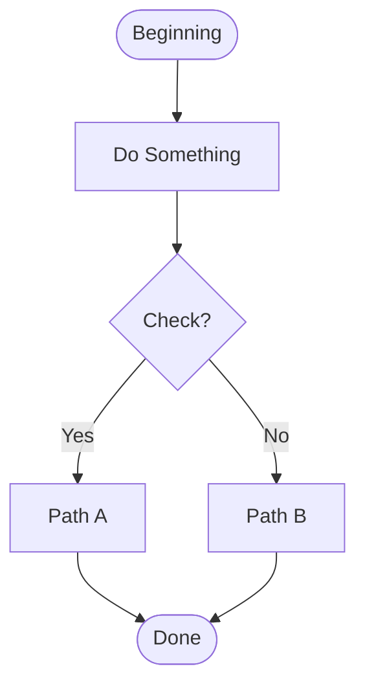
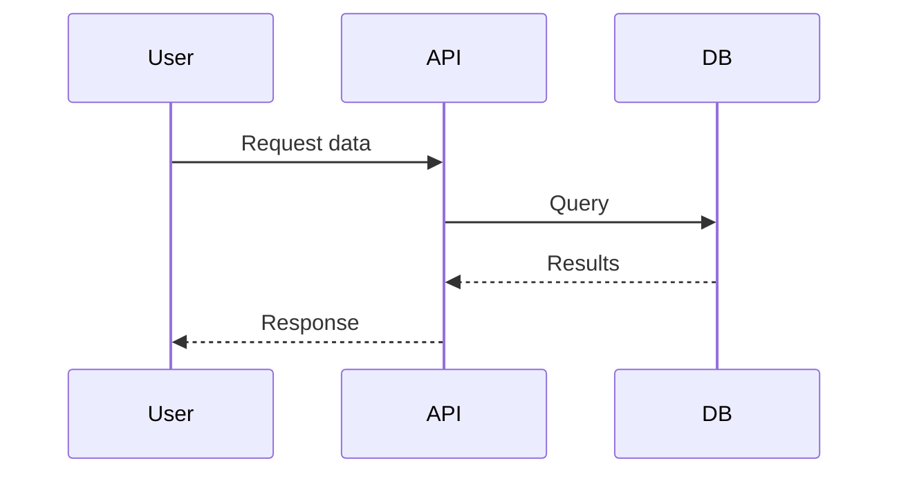
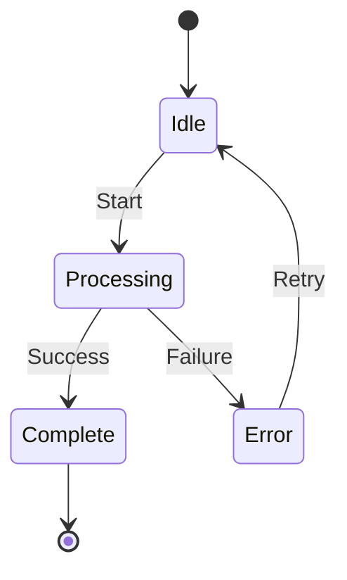
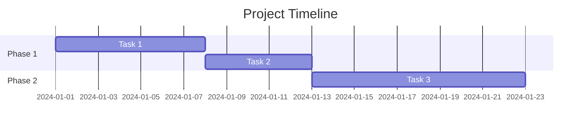
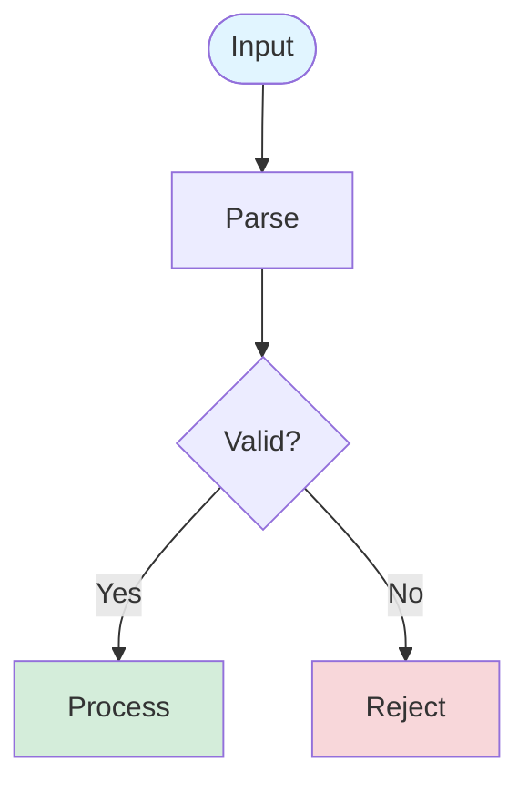
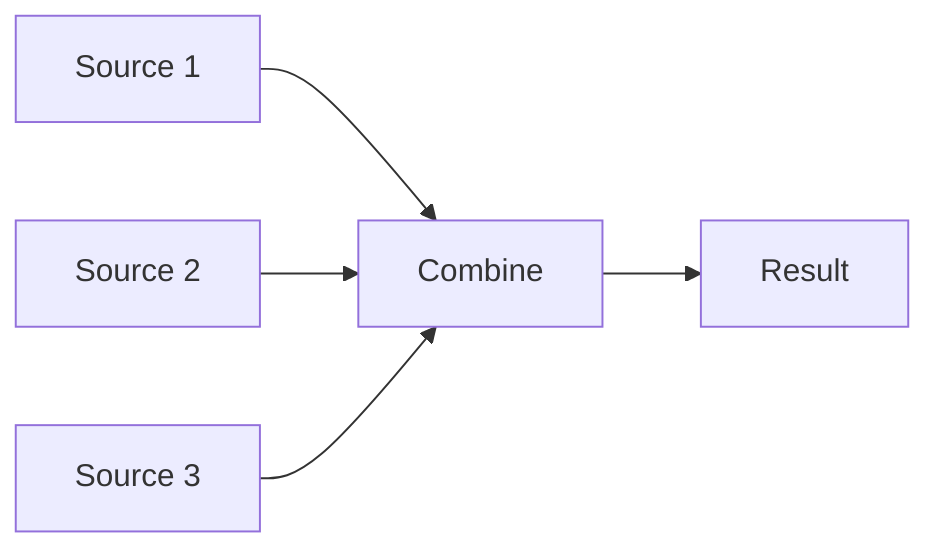
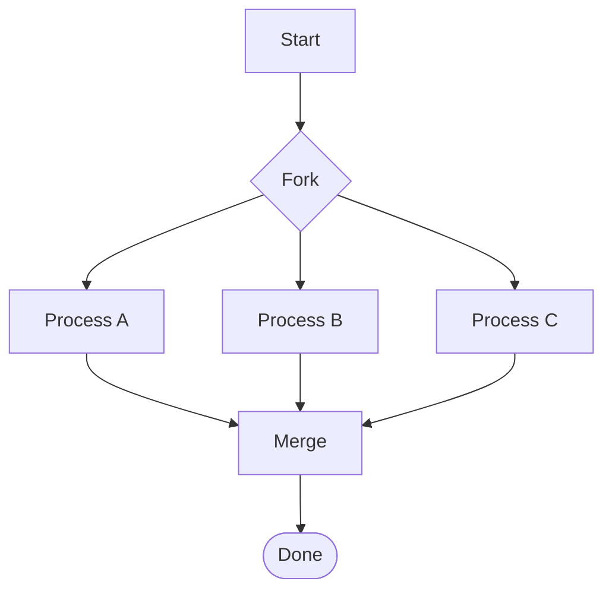

# Mermaid Diagram Generation

Generate professional diagrams as code using Mermaid.js syntax, then render to images.

## When to Use

- Workflow diagrams showing process flow
- Information transfer/progression diagrams
- System architecture visualizations
- State machines and transitions
- Sequence diagrams (API calls, interactions)
- Gantt charts for project timelines
- Entity relationship diagrams

## Quick Start

1. Write Mermaid syntax to a `.mmd` file
2. Render with `mmdc` CLI
3. Output is ready to share

## Rendering Command

```bash
mmdc -i input.mmd -o output.png -b transparent -p /root/.openclaw/workspace/skills/mermaid/references/puppeteer-config.json
```

**Required flags:**
- `-p` with puppeteer config (fixes `--no-sandbox` for root execution)
- `-b transparent` for clean backgrounds

## Diagram Types

### Flowchart (most common)



**Layout directions:**
- `TD` / `TB` = Top to bottom
- `LR` = Left to right
- `RL` = Right to left
- `BT` = Bottom to top

**Node shapes:**
- `[Rectangle]` = Standard process
- `([Rounded])` = Start/End/Terminator
- `{Diamond}` = Decision
- `[[Subroutine]]` = Subprocess
- `[(Database)]` = Data store
- `((Circle))` = Connector

**Styling:**
```mermaid
style NodeId fill:#e1f5ff,stroke:#333
```

### Sequence Diagram



### State Diagram



### Gantt Chart



## Helper Script

Use `scripts/render_mermaid.sh` for simplified rendering:

```bash
./scripts/render_mermaid.sh input.mmd output.png
```

The script handles paths and config automatically.

## Examples

See `references/examples.md` for complete diagram examples across all types.

## Best Practices

**Clarity over complexity:**
- Keep diagrams focused on one concept
- Use 5-15 nodes (not 50)
- Color code for meaning, not decoration

**Consistent naming:**
- Use descriptive node IDs (not `A`, `B`, `C`)
- Match business/technical terminology

**Progressive disclosure:**
- High-level diagram first
- Link to detailed sub-diagrams if needed
- Don't cram everything into one graphic

## Common Patterns

**Decision tree with colors:**


**Multi-path convergence:**


**Parallel processing:**


## Troubleshooting

**Rendering fails:**
- Check for syntax errors in `.mmd` file
- Ensure puppeteer config path is correct
- Run `mmdc --version` to verify installation

**Diagrams too large:**
- Use `LR` layout instead of `TD` for wide diagrams
- Split into multiple focused diagrams
- Adjust canvas size with `%%{init: {'theme':'base', 'themeVariables': { 'primaryColor':'#fff'}}}%%` in mmd file

## Output Storage

Store diagrams in organized locations:
- `/root/.openclaw/workspace/diagrams/YYYY-MM-DD/` for dated work
- Project-specific folders for documentation

Keep `.mmd` source files alongside `.png` output for future editing.
