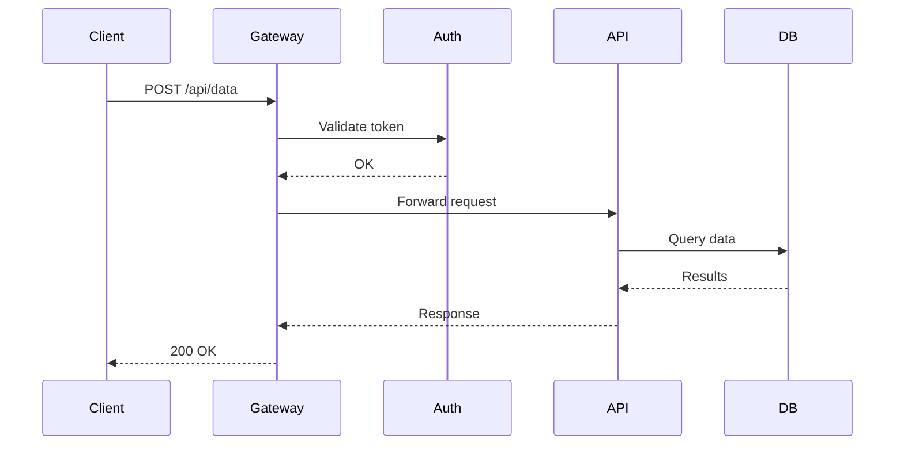
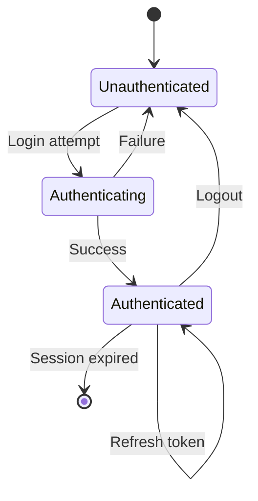
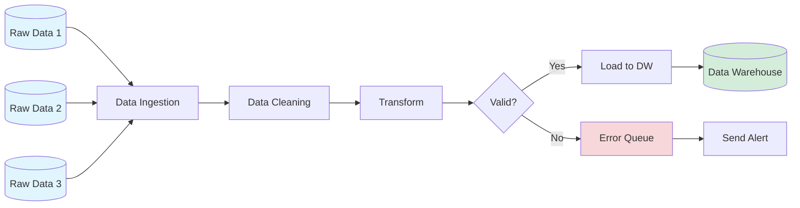
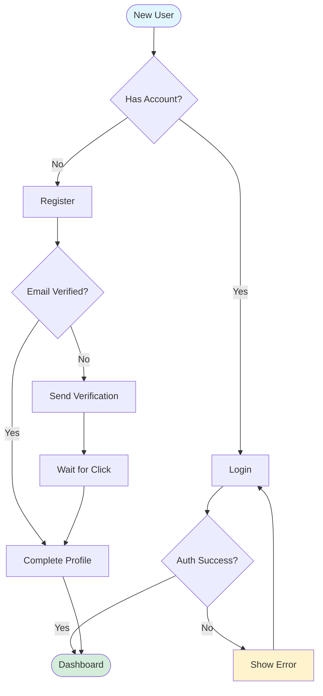
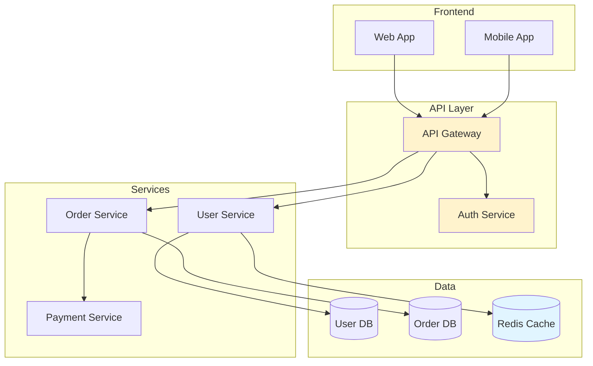
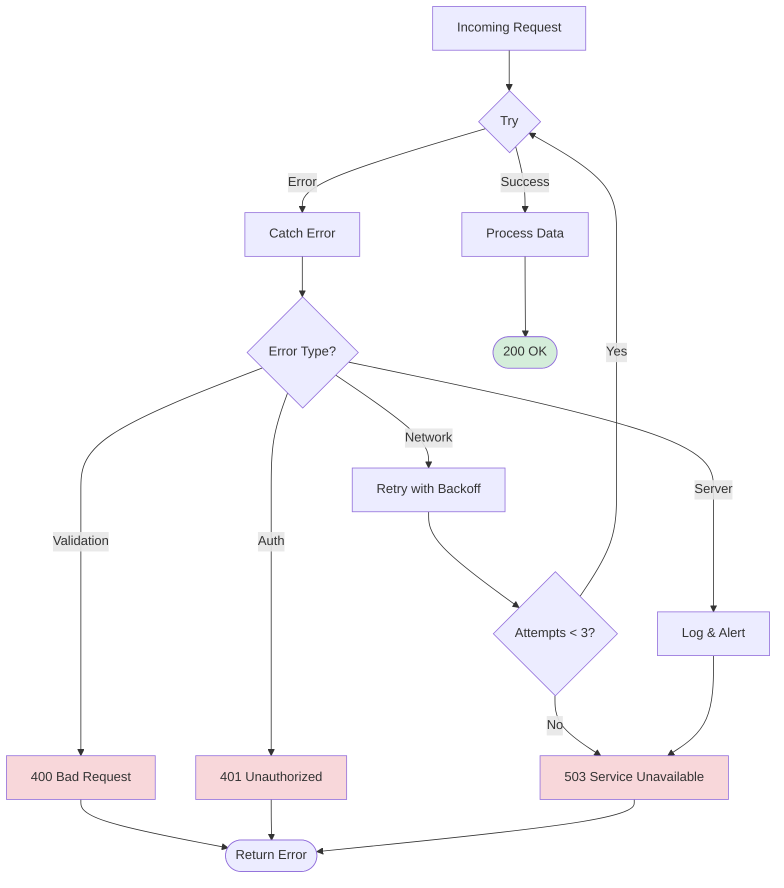
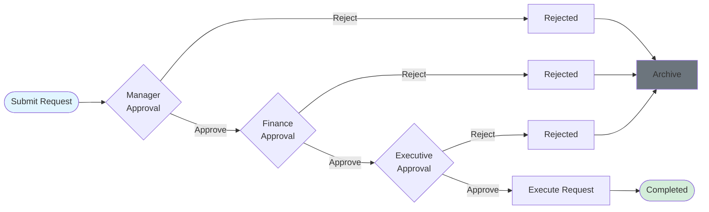

# Mermaid Diagram Examples

Complete examples of common diagram patterns.

## API Request Flow (Sequence Diagram)

## State Machine (Authentication)

## Data Pipeline (Flowchart)

## Decision Tree (User Onboarding)

## System Architecture (Component Diagram)

## CI/CD Pipeline (Gantt Chart)

```mermaid
gantt
    title Deployment Pipeline
    dateFormat HH:mm
    
    section Build
    Clone Repo: done, 00:00, 2m
    Install Deps: done, 00:02, 5m
    Run Tests: done, 00:07, 8m
    Build Assets: active, 00:15, 10m
    
    section Deploy
    Push to Registry: 00:25, 3m
    Update Staging: 00:28, 5m
    Health Check: 00:33, 2m
    Deploy Production: 00:35, 10m
```

## Error Handling Flow

## Multi-Stage Approval

## Use These As Templates

Copy and modify these examples for your specific use cases. Focus on:

- Clear node naming (not `A`, `B`, `C`)
- Consistent styling for similar elements
- Logical flow direction
- Color coding for status/importance
